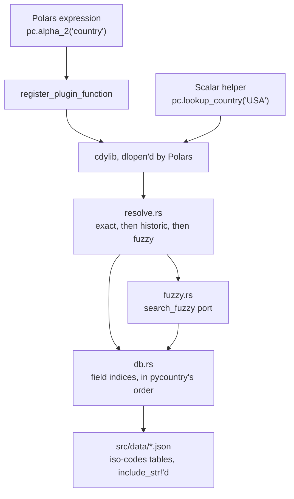

# Architecture

This package exists to give Polars the answers `pycountry` gives, without the per-row trip into the interpreter. That
makes fidelity the design constraint, not speed: a faster lookup that disagrees with the reference is worse than no
lookup at all, because the disagreement is invisible until someone reconciles a report.

This page explains how the Rust implementation maps onto `pycountry`'s, and which of its behaviors are load-bearing.
Read it before changing the matching rules.

## The shape of the thing

One compiled artifact serves both paths, so the vectorized expressions and the scalar helpers cannot disagree: they run
the same code over the same tables.

## Reproducing `pycountry`'s lookup

`pycountry.db.Database` builds one index per field, mapping each lowercased value to its record. `lookup()` then walks
those indices **in the order the fields were first seen in the JSON** and returns the first hit.

That ordering is observable behavior, not an implementation detail. It decides what an ambiguous string resolves to,
and reporting it is what `matched_on` does. So:

- Records are parsed with their keys in file order, using serde_json's `preserve_order` feature. This is the reason for
  that dependency; without it the indices would be built in hash order and `lookup` would answer differently.
- Fields are **not** modelled as a Rust struct. A field this crate did not know about would silently drop out of the
  index and change what `lookup` returns. `CodeTable` holds a flat `Vec<Option<String>>` per record with a parallel
  `fields` vector, and the typed accessors resolve their slots once at load.
- Duplicate values are **last write wins**, matching `pycountry` — which logs the collision as an error in the database
  and then overwrites anyway. This is not theoretical: ISO 3166-3 has eight countries withdrawn in 1977 and reuses the
  code `CS`, so `historic_countries.lookup("1977")` answers with the last of them.

`src/db.rs` has a unit test pinning the field order for all three code tables. If upstream reshuffles its keys, that is
where it surfaces.

## Reproducing `search_fuzzy`

`ExistingCountries.search_fuzzy` scores every country over four passes and ranks them, ties breaking on alpha-2
ascending. `src/fuzzy.rs` ports it pass for pass. Two of its behaviors look like bugs and are reproduced deliberately:

- **Pass 2 scans every field of every subdivision**, not just names — the code, the type, and the derived country code
  included. So `"state"` scores 49 points for each of the hundreds of subdivisions typed `State`, and `"us"` scores 49
  for each of the 57 US ones. This is why `search_fuzzy("state")` returns a ranked list rather than nothing.
- **Pass 3 never checks `common_name`**, despite an upstream comment saying it prefers a match there. It checks `name`,
  `official_name` and `comment`.

Both are asserted by `tests/test_parity.py`, which compares the *whole ranked list* rather than just the winner — two
implementations can agree on the top result while disagreeing about everything below it.

What is optimized rather than reproduced is the cost. `pycountry` re-derives everything per call; here the accent-folded
forms and initials are precomputed at load, pass 2 is a hash lookup into a prebuilt index rather than a scan, and each
expression call memoizes by input string. The scores are identical; only the work is not.

## Normalization

Two different normalizations are in play, and conflating them is the easiest way to diverge:

| | used by | behavior |
| --- | --- | --- |
| `str.lower()` | the exact indices | case-insensitive, accent-**sensitive** |
| `remove_accents(v.lower())` | fuzzy search | case- and accent-insensitive |

That asymmetry is why `pycountry.countries.lookup("Cote d'Ivoire")` raises while `search_fuzzy` finds it, and this
package inherits it. `src/fold.rs` ports `remove_accents` directly: NFKD, then drop every character with a nonzero
canonical combining class, guarded by the same `isascii()` fast path the reference uses.

One subtlety worth knowing about: `search_fuzzy` scores a partial match by how *early* in the name it starts, and Python
measures that in characters. `fold::char_find` therefore returns a character offset, not a byte offset — a byte offset
would score accented and non-Latin names differently.

## Concurrency and the table swap

The tables live behind an `OnceLock<RwLock<Arc<Db>>>`. Readers call `db::current()`, which clones the `Arc` and drops
the lock immediately, so:

- a replacement never blocks a lookup,
- an expression evaluation takes one snapshot and shares it across the whole rayon fan-out, so no single column can be
  resolved against two different snapshots,
- a query already in flight keeps the tables it started with.

`load_from_dir` parses and validates everything *before* swapping, so a bad directory leaves the process running on the
tables it already had.

## Deliberate divergences

Two, both documented in the README and asserted in the parity suite so they stay deliberate:

- **Blank input is null.** `search_fuzzy("")` matches every country — the empty string is a substring of every name, at
  offset 0 — and ranks Andorra first. In a DataFrame that turns every blank cell into a confident wrong answer.
- **No fuzzy search over currencies or the historic table.** `pycountry` gives `search_fuzzy` to countries and
  subdivisions only. Inventing one for the others would be behavior with no reference to check against, which is exactly
  what this package is trying not to have.

## Why the tables are compiled in

`include_str!` over the four JSON files means no network at import, no cache directory, no first-call latency spike, and
no way for two processes on the same cluster to disagree about which snapshot they are using.

The cost is a licensing obligation: those tables are LGPL-2.1-or-later, so every wheel is a distribution of an LGPL work
in combined form. The runtime replacement mechanism — `POLARS_COUNTRY_DATA` and `load_iso_data` — is not only a
convenience feature; it is how this package meets the LGPL's requirement that a recipient be able to modify the licensed
portion and use the result. See [NOTICE](https://github.com/andrewadlof/polars-country/blob/main/NOTICE). Removing or
weakening that mechanism would be a licensing change, not just an API change.
